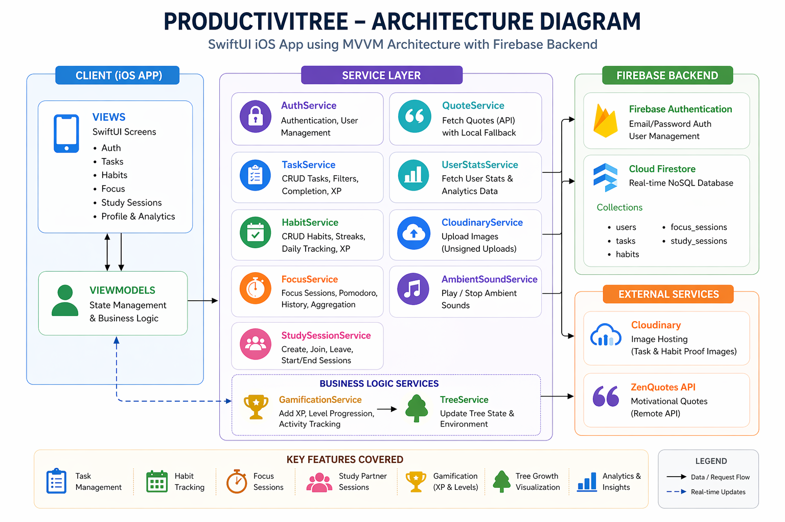
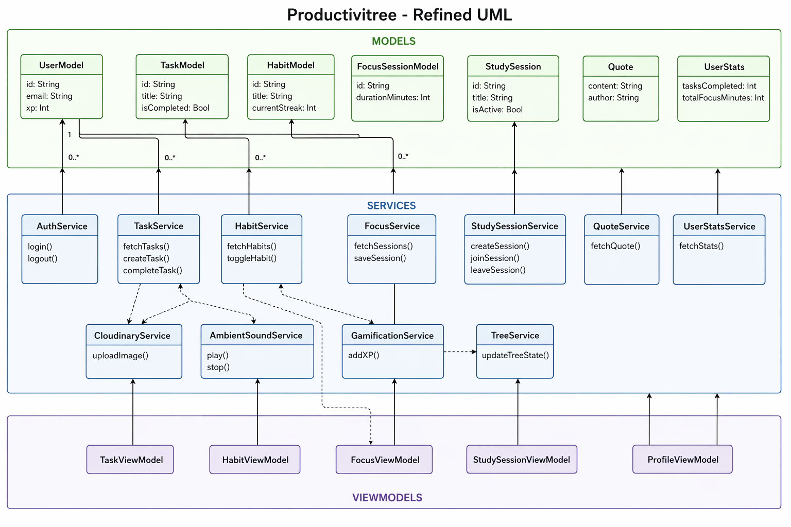
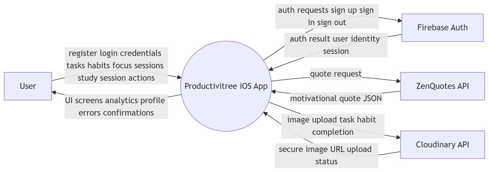
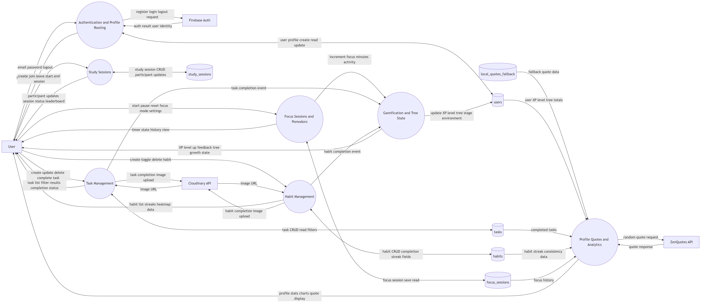

# Productivitree

Productivitree is a SwiftUI iOS app that combines personal productivity with social accountability and gamification.

It brings together:

- Task management
- Habit tracking
- Focus sessions (including Pomodoro support)
- Study partner sessions
- XP/level progression
- Tree growth visualization
- Weekly analytics

The app uses Firebase Authentication and Cloud Firestore for backend services.

## Table of Contents

- [Overview](#overview)
- [Core Features](#core-features)
- [Tech Stack](#tech-stack)
- [Architecture](#architecture)
- [High-Level System Architecture Diagram](#high-level-system-architecture-diagram)
- [UML Class Diagram](#uml-class-diagram)
- [DFD Level 0 (Context Diagram)](#dfd-level-0-context-diagram)
- [DFD Level 1](#dfd-level-1)
- [Project Structure](#project-structure)
- [Data Model and Firestore Collections](#data-model-and-firestore-collections)
- [Getting Started](#getting-started)
- [Configuration](#configuration)
- [Security and Secrets](#security-and-secrets)
- [Build and Run](#build-and-run)
- [Testing Status](#testing-status)
- [Roadmap](#roadmap)
- [Contributing](#contributing)
- [License](#license)

## Overview

Productivitree is designed to make productivity visible and rewarding. Users create tasks, maintain habits, run focus timers, and join shared study sessions. Progress is converted into XP, levels, and a virtual tree that evolves over time.

Project metadata:

- Product name: Productivitree
- Project codename: ABCD
- Platform: iOS (SwiftUI)
- Architecture: MVVM
- Backend: Firebase Auth + Cloud Firestore

## Core Features

### Authentication

- Email/password registration and login
- Auth state listener with automatic view routing
- User profile document creation in Firestore

### Tasks

- Create, view, update, and delete tasks
- Priority levels: High, Medium, Low
- Optional deadlines
- Completion with optional image proof upload
- Filter views: All, Today, Completed, High Priority, Unfinished
- XP rewards on task completion

### Habits

- Habit CRUD
- Daily completion toggle
- Current and best streak tracking
- Habit heatmap visualization
- Optional completion image upload
- XP anti-duplication guard using awarded-date tracking

### Focus Sessions

- Configurable focus and break durations
- Focus modes: Deep Work, Learning, Creating
- Optional Pomodoro cycles (4-cycle flow)
- Focus history persistence
- Total focus minute aggregation
- Ambient sound support (local bundled audio)

### Study Sessions (Social Accountability)

- Create, join, leave, and delete study sessions
- Real-time participant updates
- Creator-only start/end/delete controls
- Session activity and leaderboard tracking

### Gamification and Tree Growth

- XP + level progression
- Level-up event notifications
- Tree stages based on XP: seed -> sprout -> sapling -> tree -> forest
- Environment states based on streak/activity/time: normal, sunny, rainy, night

### Profile and Analytics

- User profile with XP progress and level display
- Stat cards (tasks completed, focus time, best streak)
- Motivational quotes (remote API + local fallback)
- Weekly charts for:
  - Focus minutes
  - Tasks completed
  - XP growth

## Tech Stack

- Language: Swift
- UI: SwiftUI
- Reactive layer: Combine
- Charts: Swift Charts
- Audio: AVFoundation
- Backend:
  - FirebaseCore
  - FirebaseAuth
  - FirebaseFirestore
- Image hosting: Cloudinary (unsigned uploads)
- Quote source: zenquotes.io (with local JSON fallback)
- Package management: Swift Package Manager (SPM)

## Architecture

This project follows MVVM:

- Models: Codable domain entities
- Services: Firebase/network/business operations
- ViewModels: UI state orchestration
- Views: SwiftUI screens and components

High-level flow:

1. Views bind to ViewModels.
2. ViewModels call Services.
3. Services read/write Firestore and external APIs.
4. Published state updates drive reactive UI refresh.

## High-Level System Architecture Diagram



## UML Class Diagram



## DFD Level 0 Context Diagram



## DFD Level 1



## Project Structure

```text
ABCD/
  ABCD/
    ABCDApp.swift
    ContentView.swift
    GoogleService-Info.plist
    Models/
    Services/
    Utilities/
    ViewModels/
    Views/
      Auth/
      Tasks/
      Habits/
      Focus/
      StudySessions/
      Profile/
      Analytics/
      Components/
    Resources/
      quotes.json
  ABCD.xcodeproj/
  firebase/
    firestore.rules
    storage.rules
```

## Data Model and Firestore Collections

Configured Firestore collections:

- users
- tasks
- habits
- focus_sessions
- study_sessions

Core model files include:

- UserModel
- TaskModel
- HabitModel
- FocusSessionModel
- StudySession
- UserStats

## Getting Started

### Prerequisites

- macOS with Xcode installed
- Apple simulator or device for iOS testing
- Firebase project
- (Optional) Cloudinary account for image upload flows

### Installation

1. Clone the repository.
2. Open `ABCD.xcodeproj` in Xcode.
3. Add `GoogleService-Info.plist` to `ABCD/ABCD/`.
4. Ensure Firebase Authentication (Email/Password) and Firestore are enabled.
5. Build and run.

## Configuration

### Firebase

1. Create/select your Firebase project.
2. Add an iOS app matching your bundle identifier.
3. Download `GoogleService-Info.plist`.
4. Place it under `ABCD/ABCD/` and include it in the app target.
5. Deploy security rules from `firebase/firestore.rules`.

### Cloudinary (Optional but used by task/habit image completion)

Cloudinary settings are currently read from `ABCD/Utilities/Constants.swift`:

- cloudName
- unsignedUploadPreset
- uploadsFolder

If you use your own Cloudinary account, update those constants to match your setup.

### Quotes API

`QuoteService` fetches quotes from:

- https://zenquotes.io/api/random

If the network/API request fails, the app falls back to local data:

- `ABCD/Resources/quotes.json`

## Security and Secrets

Important notes before publishing to GitHub:

- Do not commit real production secrets in public repositories.
- `GoogleService-Info.plist` contains project configuration and should generally be managed securely.
- If this repository is public, consider excluding `GoogleService-Info.plist` in `.gitignore` and using environment-specific provisioning.
- Review Cloudinary preset configuration and restrict it appropriately.
- Validate Firestore rules before production release.

## Build and Run

In Xcode:

1. Open `ABCD.xcodeproj`.
2. Select the `ABCD` target.
3. Select a simulator/device.
4. Build (Product -> Build).
5. Run (Product -> Run).

SPM will resolve Firebase dependencies automatically from:

- https://github.com/firebase/firebase-ios-sdk

## Testing Status

Current project status from plan/progress:

- Core flows implemented
- Testing and final polish in progress

Recommended QA pass:

- Auth register/login/logout
- Task CRUD and completion with/without image
- Habit daily toggles and streak behavior
- Focus session save/history/Pomodoro progression
- Study session create/join/leave/start/end/delete
- Profile stats and analytics consistency


## Contributing

1. Create a feature branch.
2. Keep changes focused and tested.
3. Open a pull request with clear description and screenshots for UI changes.

## License

No license file is currently defined in this repository.
Add a `LICENSE` file (for example MIT, Apache-2.0, or proprietary terms) before distribution.
